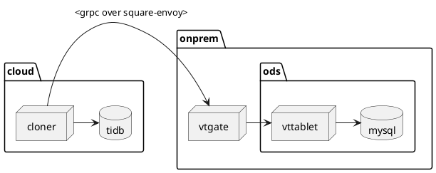

```puml
title Replication

box "AWS us-west-2 EKS"
participant "TiDB\n<franklin namespace>" as TiDB
end box

box "SJC2B"
participant "Envoy\n<app host>\nPA firewall zone" as envoy
participant "MySQL\n<ods host>\nPD firewall zone" as MySQL
end box

alt Direct access from cloud to PD
TiDB->MySQL: Read replication stream
else Access from cloud to PD via PA
TiDB->envoy: Read replication stream
envoy->MySQL: Read replication stream
end
```

