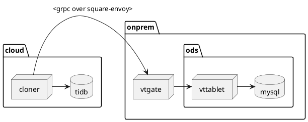

```puml
title Replication

box "AWS us-west-2 EKS"
participant "TiDB\n<franklin namespace>" as TiDB
end box

box "SJC2B"
participant "Envoy\n<app host>\nPA firewall zone" as envoy
participant "MySQL\n<ods host>\nPD firewall zone" as MySQL
end box

alt Direct access from cloud to PD
TiDB->MySQL: Read replication stream
else Access from cloud to PD via PA
TiDB->envoy: Read replication stream
envoy->MySQL: Read replication stream
end
```


```puml
title Open one socket file locally for each endpoint

box "AWS us-west-2 EKS node"
participant client
participant "client-envoy"
end box

box "node in SJC2B/PA"
participant "server-envoy"
end box

box "node in SJC2B/PD"
participant mysqld
end box

client->"client-envoy": local socket file\none socket file per host
"client-envoy"->"server-envoy": mTLS with s2s certs\nsend host with SNI
"server-envoy"->"server-envoy": terminate mTLS\nre-encrypt with ODS certs
"server-envoy"->mysqld: mTLS with ods certs\npick host based on SNI
```

```puml
title Connect to the socket file using mTLS and use SNI to indicate which endpoint

box "AWS us-west-2 EKS node"
participant client
participant "client-envoy"
end box

box "node in SJC2B/PA"
participant "server-envoy"
end box

box "node in SJC2B/PD"
participant mysqld
end box

client->"client-envoy": local socket file\nmTLS with S2S certs\nbackend in SNI
"client-envoy"->"server-envoy": mTLS passthrough
"server-envoy"->"server-envoy": terminate mTLS\nre-encrypt with ODS certs
"server-envoy"->mysqld: mTLS with ods certs\npick host based on SNI
```

